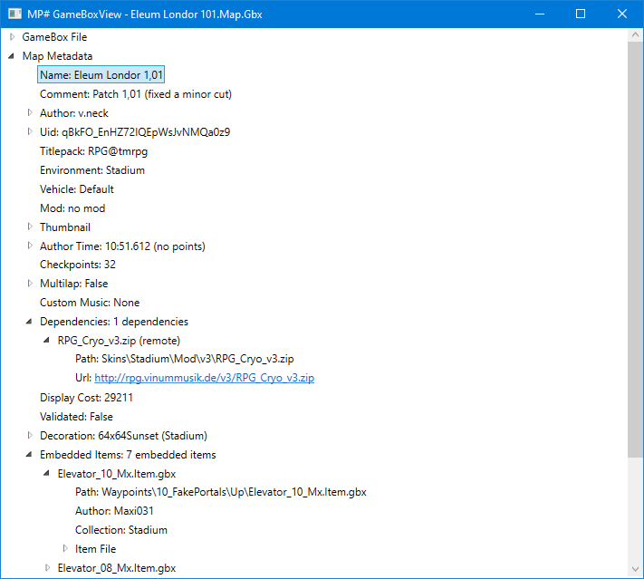

# ManiaPlanetSharp
A .NET library, written in C#, which provides easy-to-use, object-oriented ways to access data and services related to ManiaPlanet.

## License
All of the code in this repository will soon be available as open source under the terms of the [MIT License](https://tldrlegal.com/license/mit-license).

## GameBox file parsing
This library includes one of the most - if not the most - extensive gbx file parsers available. There is a general framework for parsing gbx files and implementations for the parsing of over 100 different chunks present in them, with dozens more currently being in the testing stage. The full structure of data nodes in a gbx file can be obtained via the `GameBoxFile.Parse()` method. For easy access to the most commonly needed metadata, there exist special `MetadataProvider` classes which take a `GameBoxFile` and provide direct access to the metadata - no need to dig through data nodes. Furthermore, these metadata provider classes have multiple sources for most of the properties provided, so even if there are some chunks missing in the gbx file, it can mostly still provide all of the metadata properties provided. If the specific property is present multiple times in the file, the metadata provider offers the possibility to validate the data between the different sources to detect manipulation attempts.

### GameBoxView

If you just want to look at the metadata of a `.gbx` file, you can use the `GameBoxView` application, which is a part of this project. Just drag the file in question into the app window and it will show you all of the available information, including advanced features like examining embedded items, which are not available in other applications.



### Code Example: Parsing a `.gbx` map file

First, add a reference the `ManiaPlanetSharp` assembly. For improved performance, you can also add a reference to the `ManiaPlanetSharp.GameBox.AutoGenerated` assembly, which will then be used automatically to allow for faster parsing and less memory use.

```csharp
//Parse the gbx file by path - parsing from a stream is supported, too
var file = GameBoxFile.Parse("Your-Map.Map.Gbx");
//Create an instance of the appropriate metadata provider
//This will give you direct access to the available data points without having to interact with the complex internal file structure
var metadata = new MapMetadataProvider(file);

//That's it - now you can get all the information you need from the metadata provider
//Metadata providers are implemented for maps, replays and items
Console.WriteLine($"Map '{metadata.Name}' by '{metadata.AuthorNickname}'");
Console.WriteLine($"Uid: '{metadata.Uid}'");
Console.WriteLine($"Environment: {metadata.Environment} with {metadata.Vehicle ?? "default"} vehicle");
Console.WriteLine($"Titlepack: {metadata.Titlepack}");
```

### Implementation of chunks and structs

For almost all use cases, you should never have the need to implement additional chunks for parsing. If you should need additional functionality or just want to contribute to the project to make the parser more complete, 

This library uses various methods to make implementing chunk and custom struct layouts as easy as possible. For most chunks, it's sufficient to just define the chunk/struct as a class with the fields decorated with the `[Property]` and the chunk/struct with the `[Chunk(0xCHUNKID)]`/`[CustomStruct]` attribute.

A typical example of how an implementation of a chunk looks like is the chunk `0x03043308`:

```csharp
//The Chunk attribute sets the chunk id that is parseable with this layout and whether the chunk is skippable
//If multiple chunk ids map to the same class, multiple Chunk attributes can be applied to the same class
[Chunk(0x3043008)]
public class MapAuthorChunk
    : Chunk //Chunks have to inherit from Chunk, which is a superclass of Node
{
    //A property that corresponds to a value in the chunk is indicated by the [Property] attribute
    //The fields are parsed from the file in the same order as the properties are defined
    [Property]
    public uint Version { get; set; }

    [Property]
    public uint AuthorVersion { get; set; }

    [Property]
    public string Login { get; set; }

    [Property]
    public string Nick { get; set; }

    [Property]
    public string Zone { get; set; }

    [Property]
    public string ExtraInfo { get; set; }
}
```

That's all you need! All of the code for parsing this chunk will be generated for you automatically.

#### Implementation of complex chunks and structs

Of course it isn't always as easy as the previous example - some chunks have different versions, fields that are only parsed depending on various conditions, custom structs etc. Those are supported via the same api, so that you have to write as little code as possible:

If the property type is ambiguous to multiple data types in gbx files, you can specify the type as a part of the `[Property]` attribute (a property of type `string` will default to a non-lookback string and a property of a type [derived of] `Node` will default to the node just being there - if you want to parse a lookback-string or node reference, you have to specify it in the attribute). Arrays are supported via the `[Array]` attribute with the length of the array either being read from the file as a `uint` before the start of the array if nothing is specified, hardcoded or read from another property of the chunk. Furthermore, conditional parsing is also available via the `[Condition]` attribute. If a section of your chunk/struct is too complex to be parsed by the automatically generated parser, you can use the `[CustomParserMethod]` attribute to specify a method, which takes a `GameBoxReader` object and returns the parsed value of the property.

A great example of how the advanced features can be used to parse even the most complex chunks is the chunk `0x0304301F`:

```csharp
[Chunk(0x0304301F)]
public class MapChunk
    : Chunk
{
    //This property is a lookback string instead of a normal string, so we have to specify that
    [Property(SpecialPropertyType.LookbackString)]
    public string Uid { get; set; }

    [Property(SpecialPropertyType.LookbackString)]
    public string Environment { get; set; }

    [Property(SpecialPropertyType.LookbackString)]
    public string Author { get; set; }

    //This property is just a normal string so we don't have to specify anything
    [Property]
    public string Name { get; set; }

    [Property(SpecialPropertyType.LookbackString)]
    public string TimeOfDay { get; set; }

    [Property(SpecialPropertyType.LookbackString)]
    public string DecorationEnvironment { get; set; }

    [Property(SpecialPropertyType.LookbackString)]
    public string DecorationEnvironmentAuthor { get; set; }

    //Some special data types are also supported by the automatic parser, e.g. file references, 2D and 3D sizes and 2D and 3D vectors
    [Property]
    public Size3D Size { get; set; }

    [Property]
    public bool NeedsUnlock { get; set; }

    [Property]
    public uint Version { get; set; }

    //The layout of this property in the file cannot be represented with the attributes, so we specify a custom method to parse this property
    [Property, CustomParserMethod(nameof(MapChunk.ParseBlocks))]
    public Block[] Blocks { get; set; }

    //This is the custom parser method for the property above. It has to be a public instance method that takes a GameBoxReader and returns a value of the same type as the property
    public Block[] ParseBlocks(GameBoxReader reader)
    {
        //The block struct can be parsed by the automatically generated parser
        CustomStructParser<Block> blockParser = ParserFactory.GetCustomStructParser<Block>();

        //This count of blocks that specified the length of the array does not count blocks with empty flags, so we have to read them one by one and check if they are actually counted
        Block[] blocks = new Block[reader.ReadUInt32()];
        for (int i = 0; i < blocks.Length; i++)
        {
            //Use the auto-generated block parser to parse a block instance
            Block block = blockParser.Parse(reader);
            if (block.Flags.HasFlag(BlockFlags.Null))
            {
                i--; //Ignore parsed block
            }
            else
            {
                blocks[i] = block;
            }
        }

        return blocks;
    }
}

//This is a custom struct used in the chunk above - custom structs have to have the CustomStruct attribute to be able to automatically generate parsers for them
[CustomStruct]
public class Block
{
    [Property(SpecialPropertyType.LookbackString)]
    public string Name { get; set; }

    [Property]
    public byte Rotation { get; set; }

    [Property]
    public byte X { get; set; }

    [Property]
    public byte Y { get; set; }

    [Property]
    public byte Z { get; set; }

    //This is a property that can be represented by an enum. The parser does not support enums out of the box, so support is implemented via one property in which the value is put by the parser and a wrapper property that converts that value to the enum type
    [Property]
    public uint FlagsU { get; set; }
    public BlockFlags Flags => (BlockFlags)this.FlagsU;
    
    //This is a conditional property - it only gets parsed if the condition is fulfilled (in this case if the Flags property of the current Block instance has the CustomBlock flag)
    [Property, Condition(nameof(Block.Flags), ConditionOperator.DoesNotHaveFlag, BlockFlags.Null), Condition(nameof(Block.Flags), ConditionOperator.HasFlag, BlockFlags.CustomBlock)]
    public string Author { get; set; }

    //This is a subnode inside of a chunk/struct. If it's not a node reference, nothing special has to be specified and if the type of node/chunk that is present is known, the specific type can be specified
    [Property(SpecialPropertyType.NodeReference), Condition(nameof(Block.Flags), ConditionOperator.DoesNotHaveFlag, BlockFlags.Null), Condition(nameof(Block.Flags), ConditionOperator.HasFlag, BlockFlags.CustomBlock)]
    public Node Skin { get; set; }
    
    [Property(SpecialPropertyType.NodeReference), Condition(nameof(Block.Flags), ConditionOperator.DoesNotHaveFlag, BlockFlags.Null), Condition(nameof(Block.Flags), ConditionOperator.HasFlag, BlockFlags.HasBlockParameters)]
    public Node BlockParameters { get; set; }
}

//This is just a regular flags enum, nothing special here
[Flags]
public enum BlockFlags
    : uint
{
    Null = uint.MaxValue,
    CustomBlock = 0x8000,
    HasBlockParameters = 0x100000
}
```

### Auto-generated and precompiled parsers

All of the individual parts of gbx files that can be parsed by this library are implemented via auto-generated parsers. These are generated at runtime by default. For improved performance, you can add the `ManiaPlanetSharp.GameBox.AutoGenerated` assembly to your project alongside the `ManiaPlanetSharp` assembly. This assembly includes pre-compiled parsers for all chunks and structs implemented as a part of ManiaPlanetSharp, which will be used if present and offer better performance. You don't have to directly interface with the additional assembly at all - the `ManiaPlanetSharp` assembly will automatically detect the presence of the precompiled parsers and use them instead of generating them dynamically.


## ManiaPlanet text format parser
Status: Planned in the near future

## [ManiaExchange API](https://api.mania-exchange.com/documents/reference)
Status: Implemented, missing newest features

## NadeoImporter interaction
Status: Working prototype exists

## Dedimania API
Status: Planned

## ManiaPlanet Client Telemetry
Status: Planned
